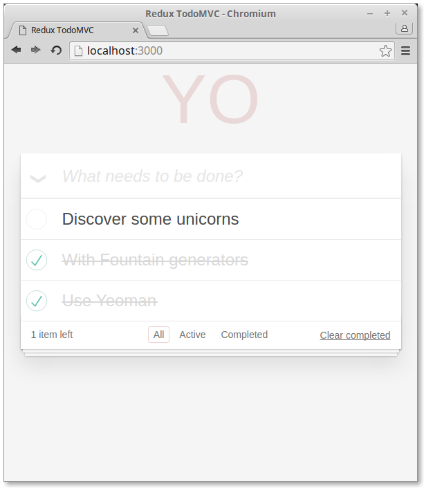
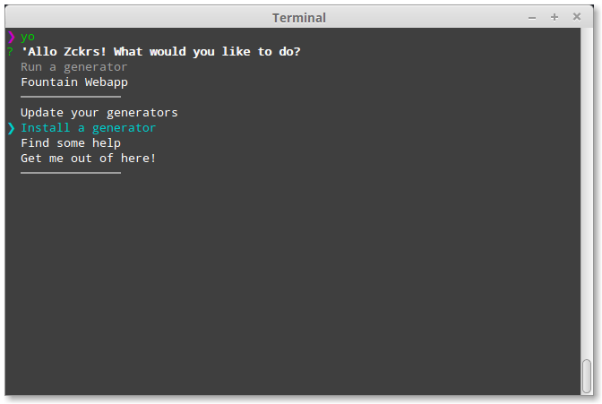
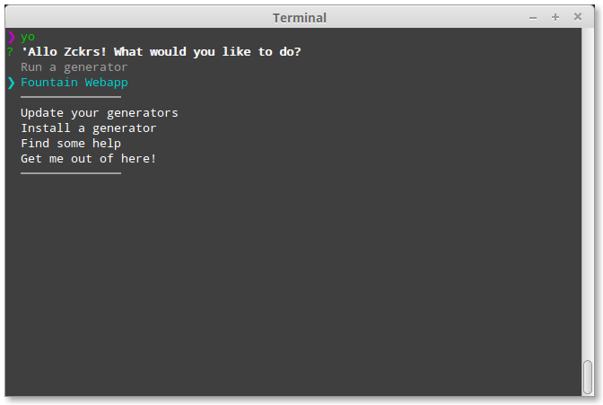
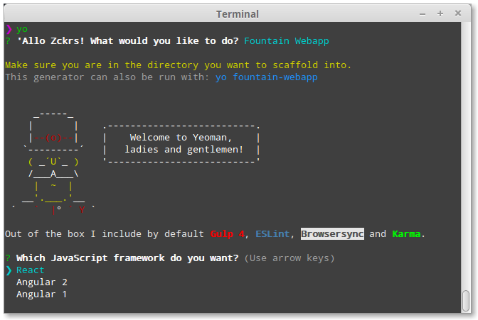
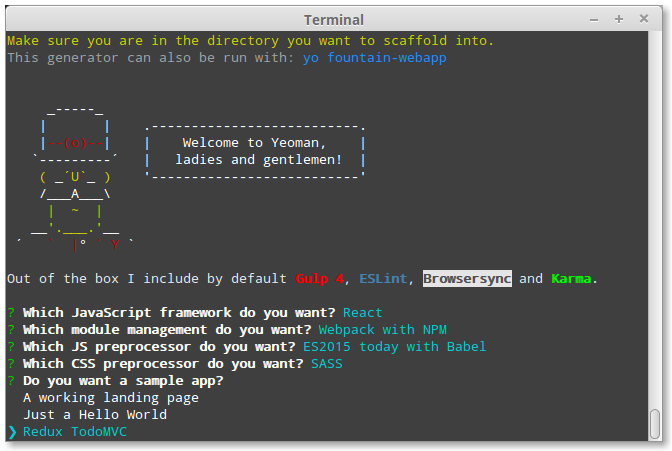
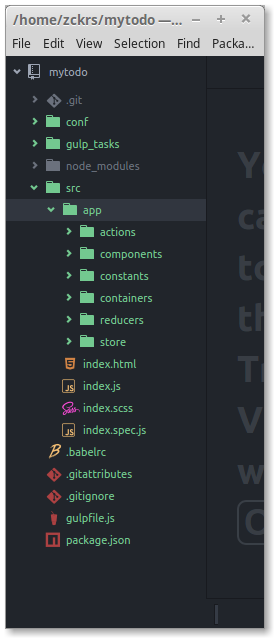

> 原文： [LET'S SCAFFOLD A WEB APP WITH YEOMAN](http://yeoman.io/codelab/index.html)


在这25分钟的codelab中，我们将使用  [Yeoman](http://yeoman.io/)  和  [FountainJS](http://fountainjs.io/)   从头开始构建功能完整的Web应用程序。示例应用程序将使用 [React](https://reactjs.org/) 、 [Angular2](https://angular.io/) 或 [Angular1](https://angularjs.org/) 编写。


不知道React或Angular？没关系，我们会带你过一遍。但是需要您有一些JavaScript经验。

## 使用Yeoman构建一个示例应用程序

构建的示例Web应用程序是 [TodoMVC](http://todomvc.com/) 的一个实现。能够添加待办事项，删除待办事项，过滤待办事项，并且添加一项离线保存待办事项的功能。




## 代码实践

我们将从头开始构建上述TodoMVC应用程序。每一步都建立在前一个步骤上，所以每一步都要逐一进行。

完成这个codelab大约需要25分钟。

- **Step 1:** [Set up your dev environment »](http://yeoman.io/codelab/setup.html)
- **Step 2:** [Install a Yeoman generator »](http://yeoman.io/codelab/install-generators.html)
- **Step 3:** [Use a generator to scaffold out your app »](http://yeoman.io/codelab/scaffold-app.html)
- **Step 4:** [Review the Yeoman-generated app directory structure »](http://yeoman.io/codelab/review-generated-files.html)
- **Step 5:** [Preview your app in the browser »](http://yeoman.io/codelab/preview-inbrowser.html)
- **Step 6:** [Test with Karma and Jasmine »](http://yeoman.io/codelab/run-unit-tests.html)
- **Step 7:** [Make todos persistent with local storage »](http://yeoman.io/codelab/local-storage.html)
- **Step 8:** [Get ready for production »](http://yeoman.io/codelab/prepare-production.html)
- Like what you see? [Yeoman can do more »](http://yeoman.io/codelab/keep-going.html)


###Step 1: 设置开发环境 

与Yeoman的大部分交互都是通过命令行进行。在Mac上使用终端app，在Linux中运行shell脚本，在Windows上则使用cmder（推荐）/ PowerShell / cmd.exe。

#### 安装基本环境

安装脚手架需要如下条件：

- Node.js v6 及以上版本 
- npm v3 及以上版本 （与node捆绑）
- Git

可以用如下方式检测node和npm的版本

```shell
node --version && npm --version
```

如果需要升级或安装Node，最简单的方法是在您的平台上使用安装程序。从 [NodeJS网站](https://nodejs.org/) 下载适用于Windows的.msi或适用于Mac的.pkg文件。

npm包管理器与Node捆绑在一起，有些Node版本附带的npm版本较老，可以使用以下命令更新npm：

```shell
npm install --global npm@latest
```

如果安装了git，可以通过执行如下命令查看版本信息

```shell
git --version
```

如果没有安装，请从 [Git网站](https://git-scm.com/) 下载安装包


#### 安装Yeoman

在安装Node之后，安装Yeoman： 

```shell
npm install --global yo
```

**如果安装过程中遇到权限或访问错误（例如EPERM或EACCESS），请不要将sudo用作解决方法。您可以参阅 [npm-global-without-sudo](https://github.com/sindresorhus/guides/blob/master/npm-global-without-sudo.md) 获得更好的解决方法。**


#### 确认安装成功

运行以下命令检查是否安装成功

```shell
yo --version
```

命令行工具版本更新很快，本次codelab使用的是**yo 1.8.4**，如果您使用的更新的版本并遇到了问题，请在 [tracker](https://github.com/yeoman/yo/issues)  提出issue.

###  Step 2:  安装 Yeoman Generator

在传统的Web开发工作流程中，我们需要花费大量时间为Web应用程序设置样板代码、下载依赖关系以及手动创建Web文件夹结构。这些繁杂重复的流程可以用 Yeoman Generator来简化！下面为FountainJS项目安装一个generator。

#### 安装generator

我们可以使用npm来安装Yeoman生成器，[npm](https://www.npmjs.com/)  有超过 [3500多个Generator](http://yeoman.io/generators/) (可能需要翻墙)可用，其中很多是由开源社区编写的。

安装 [generator-fountain-webapp](https://www.npmjs.com/package/generator-fountain-webapp) : 

```shell
npm install --global generator-fountain-webapp
```

**如果安装过程中遇到权限或访问错误（例如EPERM或EACCESS），请不要将sudo用作解决方法。您可以参阅 [npm-global-without-sudo](https://github.com/sindresorhus/guides/blob/master/npm-global-without-sudo.md) 获得更好的解决方法。**

除了直接使用npm install外，还可以通过Yeoman交互式菜单搜索Generator。运行 `yo` 并选择生成器安装.




### Step 3:  使用Generator搭建应用

我们多次使用“scaffold”这个词，但可能还不明白它的意思。在Yeoman中，Scaffolding表示根据您的配置生成Web应用程序的文件。下面来看Yeoman是如何生成的。

#### 创建项目目录

创建一个 mytodo 目录，用来存放脚手架项目文件。

```shell
mkdir mytodo && cd mytodo
```


#### 通过Yeoman菜单访问Generator

执行 `yo` 查看 Generators

```shell
yo
```

如果已经安装了几个Generators，可以从列表中选择。选择高亮的**Fountain Webapp**，点击回车运行Generator。



也可以直接运行Generator，无需使用交互式菜单：

```shell
yo fountain-webapp
```


#### 配置Generator

一些Generator提供可选设置，来自定义应用程序，以加快开发环境的初始设置。FountainJS Generator提供了这些配置供您选择：

- 框架  ([React](https://facebook.github.io/react/), [Angular2](https://angular.io/) or [Angular1](https://angularjs.org/))
- 模块管理 ([Webpack](https://webpack.github.io/), [SystemJS](https://github.com/systemjs/systemjs) or [None with Bower](http://bower.io/))
- javascript 预处理器 ([Babel](https://babeljs.io/), [TypeScript](https://www.typescriptlang.org/) or none)
- css 预处理器  ([SASS](http://sass-lang.com/), [LESS](http://lesscss.org/) or none)
- 3个示例应用  (a landing page, hello world, and TodoMVC)

 在这个codelab中，我们选择使用 **React**, **Webpack**, **Babel**, **SASS** 和 **Redux TodoMVC**示例




使用 箭头 和 回车 按钮来选择




Yeoman会自动创建你的应用，抓取依赖。


### Step 4:  检查生成的应用

打开mytodo目录，看下脚手架生成的文件，长这样：




执行 `tree -L 3` 查看3层目录结构

```
.
├── conf
│   ├── browsersync-dist.conf.js
│   ├── browsersync.conf.js
│   ├── gulp.conf.js
│   ├── karma-auto.conf.js
│   ├── karma.conf.js
│   ├── webpack-dist.conf.js
│   ├── webpack-test.conf.js
│   └── webpack.conf.js
├── gulp_tasks
│   ├── browsersync.js
│   ├── karma.js
│   ├── misc.js
│   └── webpack.js
├── gulpfile.js
├── package.json
└── src
    ├── app
    │   ├── actions
    │   ├── components
    │   ├── constants
    │   ├── containers
    │   ├── reducers
    │   └── store
    ├── index.html
    ├── index.js
    ├── index.scss
    └── index.spec.js
```

